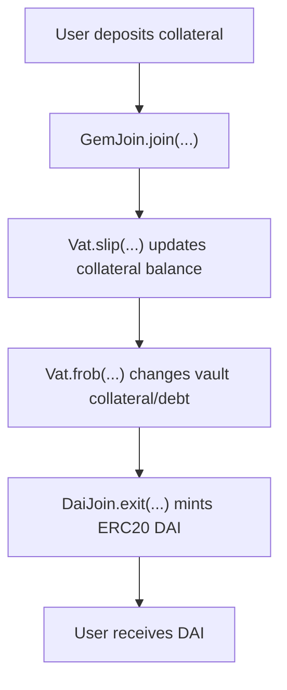
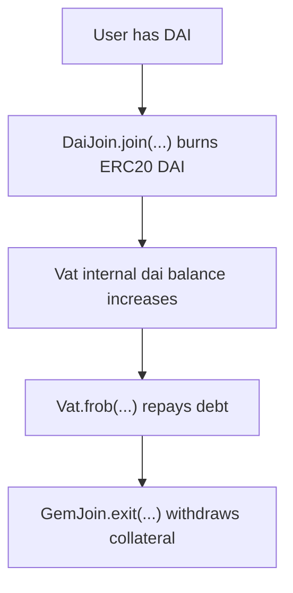
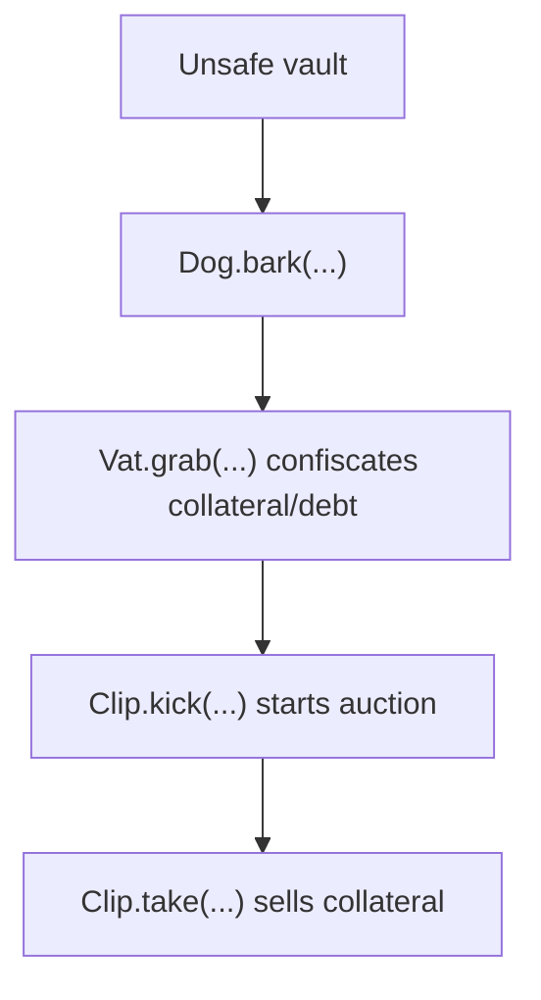

# Sky / DAI Fork Local Review

This repository is an educational local review template for a Sky / DAI-style fork.

The goal is to review the core accounting flow and prepare a clean base for manual
Break Think analysis.

```text
Understand the flow -> Define invariants -> Search for violations
```

This is not an official audit of Sky, MakerDAO, DAI, USDS, or any production deployment.
It is a portfolio-style study repository focused on function-level review and protocol
invariants.

Function names and snippets are based on the official Sky DSS source:

```text
sky-ecosystem/dss
```

## Core Model

Sky / DAI-style systems are based on internal accounting inside `Vat`.

High-level flow:



Repay / exit flow:



Liquidation flow:



## Core Functions Reviewed

### Main Vault / Accounting Functions

```text
Vat.frob(...)
GemJoin.join(...)
GemJoin.exit(...)
DaiJoin.join(...)
DaiJoin.exit(...)
```

### Main Rate / Liquidation Functions

```text
Jug.drip(...)
Dog.bark(...)
Clip.take(...)
Pot.drip(...)
Pot.join(...)
Pot.exit(...)
```

## Main Global Invariants

```text
Vault debt must be backed by enough collateral.
```

```text
ERC20 DAI supply must match Vat internal accounting boundaries.
```

```text
Unsafe vaults can be liquidated, safe vaults must not be liquidated.
```

## Additional Invariants

```text
Collateral join/exit must match Vat collateral accounting.
```

```text
DaiJoin mint/burn must match Vat internal dai movement.
```

```text
Rate accrual must update debt consistently.
```

```text
Liquidation must not exceed configured global or collateral-specific limits.
```

```text
Auction purchase must respect price, remaining debt, and remaining collateral.
```

## Repository Structure

```text
sky-dai-fork-local-review/
+-- README.md
+-- core-flow/
|   +-- 01-vat-frob.md
|   +-- 02-gemjoin-join-exit.md
|   +-- 03-daijoin-join-exit.md
|   +-- 04-jug-drip.md
|   +-- 05-dog-bark.md
|   +-- 06-clip-take.md
|   +-- 07-pot-dsr.md
+-- break-think/
    +-- README.md
```

## Break Think Format

The manual analysis should use only:

```text
INVARIANT
CONSEQUENCES
```
