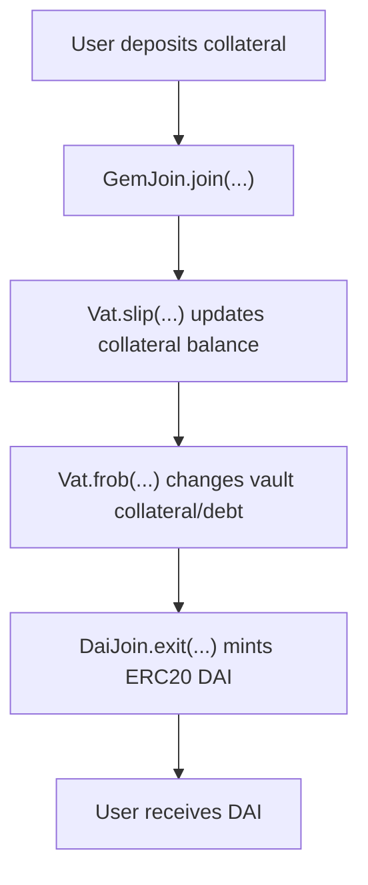
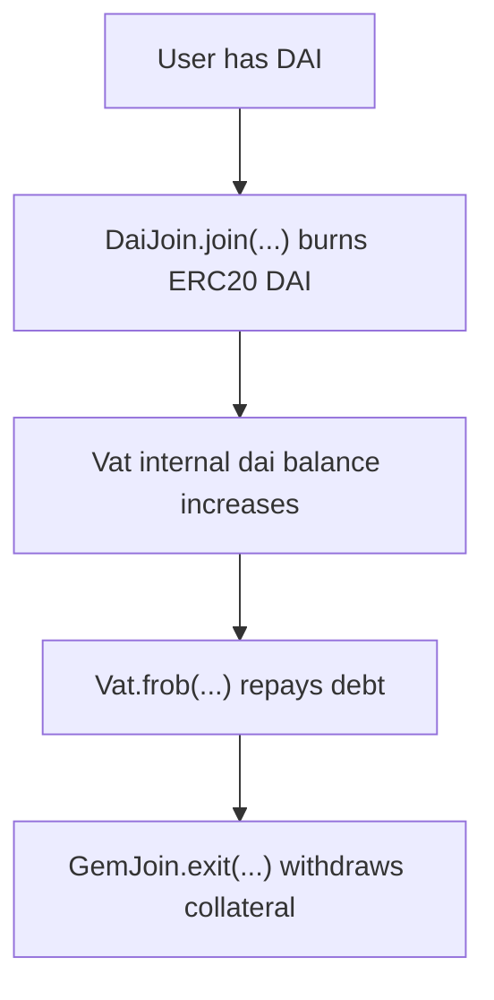
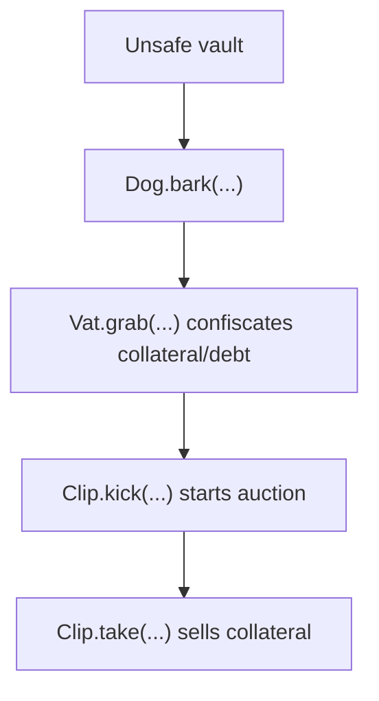

# Sky / DAI Fork Local Review

This repository is an educational local review template for a Sky / DAI-style fork.

The goal is to understand the core accounting architecture before doing manual
Break Think analysis.

```text
Understand the flow -> understand the accounting -> then do Break Think
```

This is not an official audit of Sky, MakerDAO, DAI, USDS, or any production deployment.
It is a portfolio-style study repository focused on function-level review and protocol
invariants.

Function names and snippets are based on the official Sky DSS source:

```text
sky-ecosystem/dss
```

## Core Model

Sky / DAI-style systems are based on internal accounting inside `Vat`.

High-level flow:



Repay / exit flow:



Liquidation flow:



## Core Functions Reviewed

### Main Vault / Accounting Functions

```text
Vat.frob(...)
Vat.slip(...)
Vat.flux(...)
Vat.move(...)
Vat.grab(...)
Vat.suck(...)
Vat.fold(...)
GemJoin.join(...)
GemJoin.exit(...)
DaiJoin.join(...)
DaiJoin.exit(...)
```

### Main Rate / Liquidation Functions

```text
Spot.poke(...)
Jug.drip(...)
Dog.bark(...)
Clip.take(...)
Pot.drip(...)
Pot.join(...)
Pot.exit(...)
Vow.flog(...)
Vow.heal(...)
Vow.flop(...)
Vow.flap(...)
```

## What This Repository Covers

```text
Vault accounting
Vat balance movement
Oracle price update
Collateral join / exit
DAI join / exit
Stability fee accrual
Liquidation trigger
Auction purchase
Savings rate accounting
Surplus and debt accounting
```

## Repository Structure

```text
sky-dai-fork-local-review/
+-- README.md
+-- core-flow/
|   +-- 01-vat-frob.md
|   +-- 02-gemjoin-join-exit.md
|   +-- 03-daijoin-join-exit.md
|   +-- 04-jug-drip.md
|   +-- 05-dog-bark.md
|   +-- 06-clip-take.md
|   +-- 07-pot-dsr.md
|   +-- 08-vat-balance-movement.md
|   +-- 09-vat-grab-suck-fold.md
|   +-- 10-spot-poke.md
|   +-- 11-vow-surplus-debt.md
+-- break-think/
    +-- README.md
```

## Break Think

The `break-think/` folder is left for manual analysis.

I will use it later to write:

```text
INVARIANT
CONSEQUENCES
```
