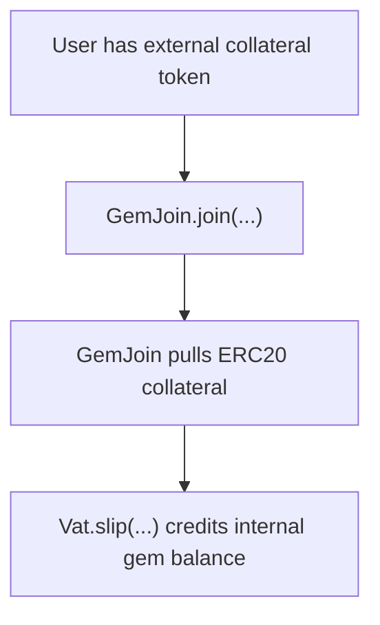
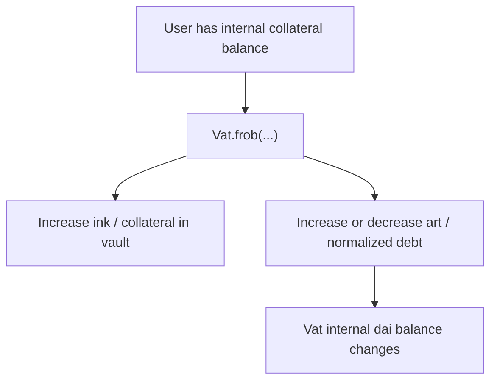
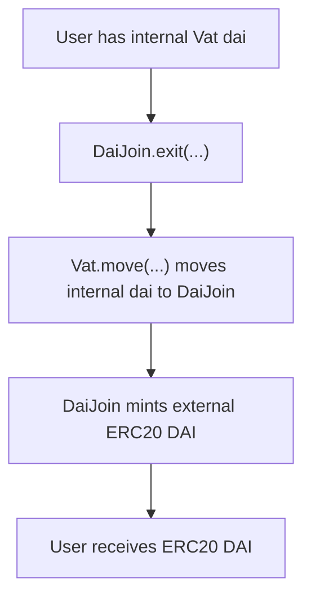
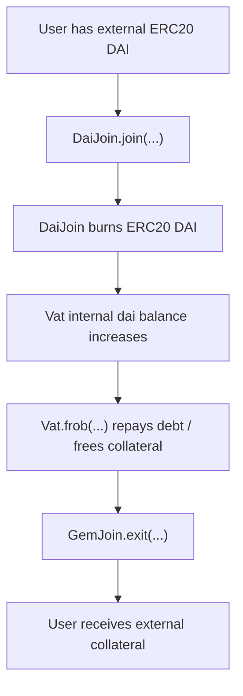
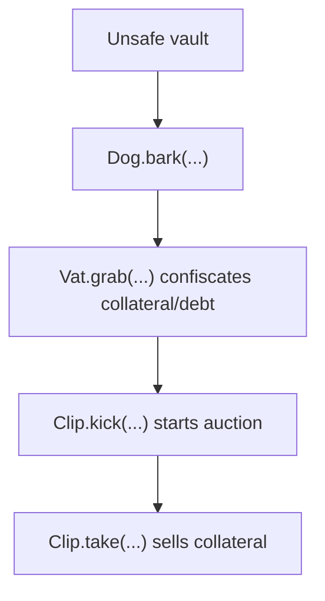
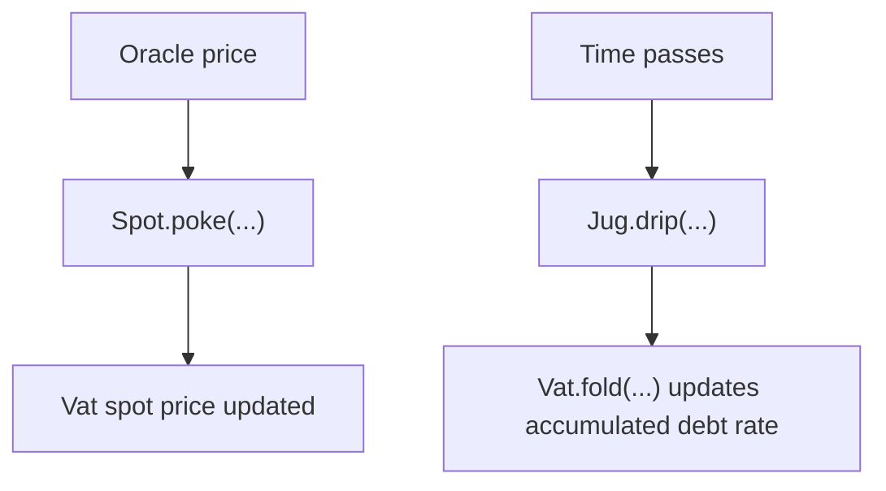
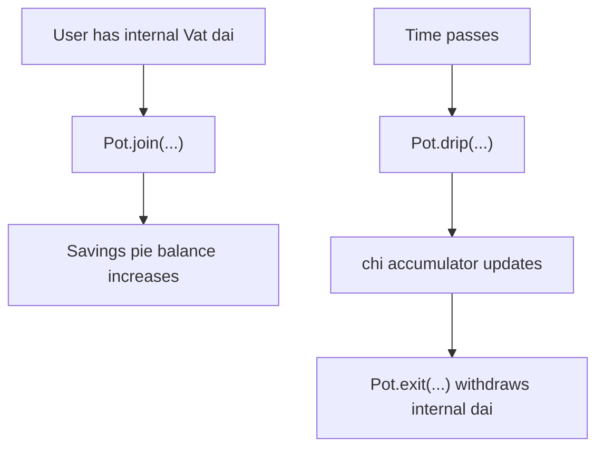

# Sky / DAI Fork Local Review

This repository is an educational local review template for the Sky DSS core flow.

The goal is to understand the core accounting architecture before doing manual
Break Think analysis.

```text
Understand the flow -> understand the accounting -> then do Break Think
```

This is not an official audit of Sky, MakerDAO, DAI, USDS, or any production deployment.
It is a portfolio-style study repository focused on architecture flow and function-level review.

Function names and snippets are based on the official Sky DSS source:

```text
sky-ecosystem/dss
```

This repository follows the core DSS contracts, not a frontend or proxy wrapper flow.

## Core Model

Sky / DAI-style systems are based on internal accounting inside `Vat`.

Important idea:

```text
Vat is the internal accounting engine.
GemJoin and DaiJoin are adapters between external ERC20 tokens and Vat balances.
```

Collateral deposit flow:



Open / modify vault flow:



Draw external DAI flow:



Repay debt and withdraw collateral flow:



Liquidation flow:



Rate / oracle flow:



DSR flow:



## Core Functions Reviewed

## Official Source Map

```text
src/vat.sol   -> Vat.frob, Vat.slip, Vat.flux, Vat.move, Vat.grab, Vat.suck, Vat.fold
src/join.sol  -> GemJoin.join, GemJoin.exit, DaiJoin.join, DaiJoin.exit
src/jug.sol   -> Jug.drip
src/spot.sol  -> Spot.poke
src/dog.sol   -> Dog.bark
src/clip.sol  -> Clip.take
src/pot.sol   -> Pot.drip, Pot.join, Pot.exit
src/vow.sol   -> Vow.flog, Vow.heal, Vow.flop, Vow.flap
```

### Main Vault / Accounting Functions

```text
Vat.frob(...)
Vat.slip(...)
Vat.flux(...)
Vat.move(...)
Vat.grab(...)
Vat.suck(...)
Vat.fold(...)
GemJoin.join(...)
GemJoin.exit(...)
DaiJoin.join(...)
DaiJoin.exit(...)
```

### Main Rate / Liquidation Functions

```text
Spot.poke(...)
Jug.drip(...)
Dog.bark(...)
Clip.take(...)
Pot.drip(...)
Pot.join(...)
Pot.exit(...)
Vow.flog(...)
Vow.heal(...)
Vow.flop(...)
Vow.flap(...)
```

## What This Repository Covers

```text
Vault accounting
Vat balance movement
Oracle price update
Collateral join / exit
DAI join / exit
Stability fee accrual
Liquidation trigger
Auction purchase
Savings rate accounting
Surplus and debt accounting
```

## Repository Structure

```text
sky-dai-fork-local-review/
+-- README.md
+-- core-flow/
|   +-- 00-dss-flow-overview.md
|   +-- 01-vat-frob.md
|   +-- 02-gemjoin-join-exit.md
|   +-- 03-daijoin-join-exit.md
|   +-- 04-jug-drip.md
|   +-- 05-dog-bark.md
|   +-- 06-clip-take.md
|   +-- 07-pot-dsr.md
|   +-- 08-vat-balance-movement.md
|   +-- 09-vat-grab-suck-fold.md
|   +-- 10-spot-poke.md
|   +-- 11-vow-surplus-debt.md
+-- break-think/
    +-- README.md
```

## Break Think

The `break-think/` folder is left for manual analysis.

I will use it later to write:

```text
INVARIANT
CONSEQUENCES
```
