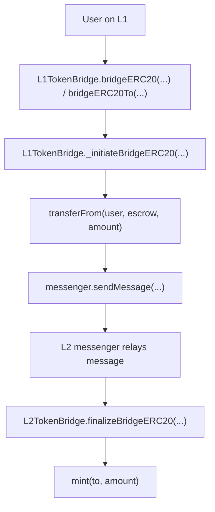
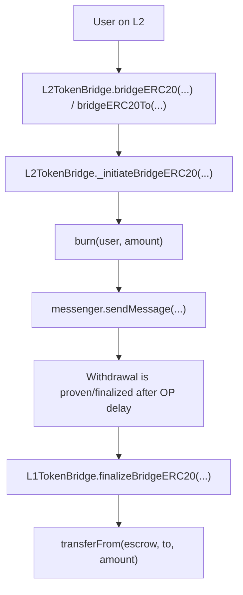

# Sky OP Token Bridge Local Review

This repository is an educational local review of the MakerDAO / Sky OP Token Bridge.

The goal is to understand the bridge architecture and the main token flow before doing manual Break Think analysis.

```text
Understand the flow -> understand the message path -> then do Break Think
```

This is not a full production audit. It is a portfolio-style study repository focused on bridge flow, escrow accounting, mint/burn logic, cross-chain messages, and auth boundaries.

## Invariant Method

This repository separates invariants into two groups.

```text
Main Invariants = the core security rules of the bridge flow.
Additional Invariants / Checks = smaller function-level checks used to understand the architecture.
```

Break Think is focused mostly on the Main Invariants.

Additional checks are kept in the flow explanation, but they are not the main focus of the manual Break Think section.

Function code snippets are based on:

```text
makerdao/op-token-bridge
```

## Bridge Model

This bridge is a custom bridge to an OP Stack L2.

Main contracts:

```text
L1TokenBridge.sol = L1 side of the bridge
L2TokenBridge.sol = L2 side of the bridge
Escrow.sol        = L1 token escrow
```

## Deposit Flow: L1 -> L2



Simple meaning:

```text
L1 tokens are locked in Escrow.
L2 tokens are minted to the recipient.
```

Main deposit invariants:

```text
L1 escrowed amount must equal L2 minted amount.
Only an authentic L1 -> L2 message can mint L2 tokens.
The L1 token must map to the correct L2 token.
```

Additional deposit checks:

```text
The bridge must be open.
The recipient must be the intended recipient.
The message must target the correct L2 bridge.
```

## Withdrawal Flow: L2 -> L1



Simple meaning:

```text
L2 tokens are burned.
L1 tokens are released from Escrow.
```

Main withdrawal invariants:

```text
L2 burned amount must equal L1 released amount.
Only an authentic L2 -> L1 message can release L1 tokens.
The L2 token must map to the correct L1 token.
```

Additional withdrawal checks:

```text
The bridge must be open.
The withdrawal amount must not exceed maxWithdraw.
The recipient must be the intended recipient.
```

## Core Functions Reviewed

### Deposit Functions

```text
L1TokenBridge.bridgeERC20(...)
L1TokenBridge.bridgeERC20To(...)
L1TokenBridge._initiateBridgeERC20(...)
L2TokenBridge.finalizeBridgeERC20(...)
```

### Withdrawal Functions

```text
L2TokenBridge.bridgeERC20(...)
L2TokenBridge.bridgeERC20To(...)
L2TokenBridge._initiateBridgeERC20(...)
L1TokenBridge.finalizeBridgeERC20(...)
```

### Admin / Escrow Functions

```text
Escrow.approve(...)
L1TokenBridge.registerToken(...)
L2TokenBridge.registerToken(...)
L2TokenBridge.setMaxWithdraw(...)
L1TokenBridge.close(...)
L2TokenBridge.close(...)
```

## Repository Structure

```text
sky-dai-fork-local-review/
+-- README.md
+-- deposit-flow/
|   +-- 00-deposit-flow.md
|   +-- 01-l1-bridgeERC20.md
|   +-- 02-l1-initiateBridgeERC20.md
|   +-- 03-l2-finalizeBridgeERC20.md
+-- withdrawal-flow/
|   +-- 00-withdrawal-flow.md
|   +-- 01-l2-bridgeERC20.md
|   +-- 02-l2-initiateBridgeERC20.md
|   +-- 03-l1-finalizeBridgeERC20.md
+-- admin-flow/
|   +-- 01-escrow-approve.md
|   +-- 02-token-admin.md
+-- break-think/
    +-- README.md
    +-- deposit-break-think.md
    +-- withdrawal-break-think.md
    +-- admin-break-think.md
```

## Break Think

The `break-think/` folder is left for manual analysis.

Format:

```text
INVARIANT

CONSEQUENCES
```
